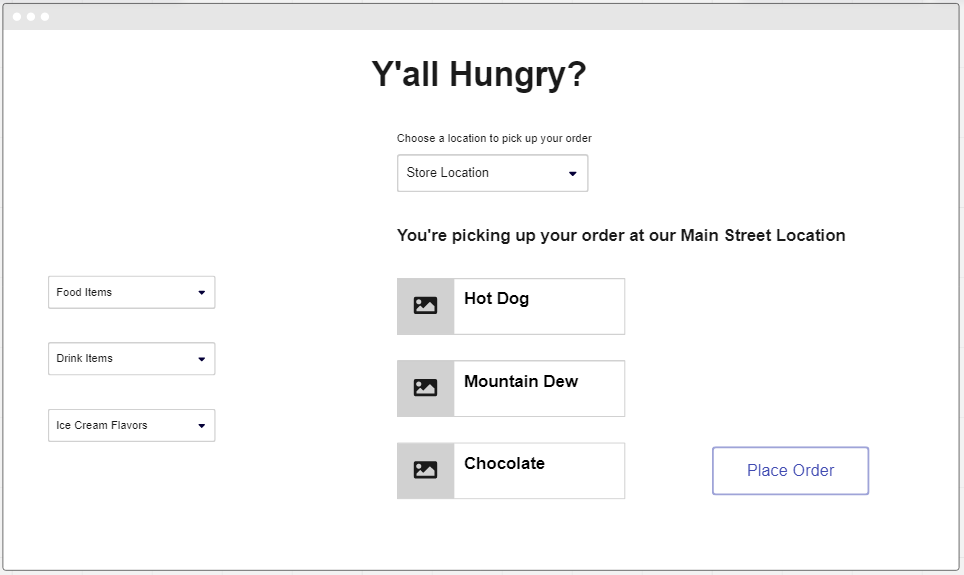

# Y'All Hungry?

This group project will have you building an application that lets you manage different food trucks selling WV hot dogs.

## Learning Objective

Completeing the project isn't what is important. The objective is to build up your skills and your knowledge of concepts.

1. Collaborative group work - Are you helping your team succeed?
2. Pacing - are you spinning your wheels instead of asking for help? Are you hindering the learning of others by wanting to make the project perfect?
3. More Github practice
4. Data structures - ERD, avoiding technical debt, consistent naming conventions
5. Navigating data relationships utilizing primary keys and foreign keys

## Wireframe

## Data Relationships

## Locations
What's the best part about owning a fleet of food trucks? They can go anywhere. Each truck will be its own location

## Food
Each food truck should only have hot dogs that are in stock on its menu.

## Drinks
Each food truck should only list drink items that are in stock on its menu.

## Dessert
Each food truck should only list dessert items that are in stock.

## Happy Toys
> This is only for a group of 5

Each food truck should have a list with only happy toys that are in stock.

## CSS

[Bootstrap is included for your convenience.](https://getbootstrap.com/)